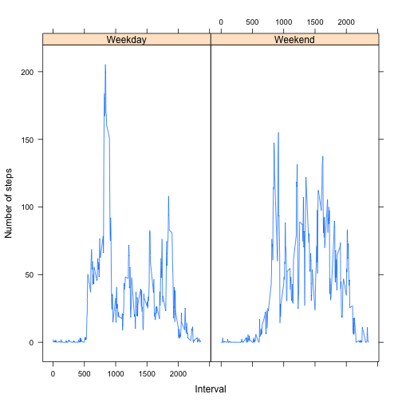

# Reproducible Research: Peer Assessment 1


```r
library(data.table)
```
## Loading and preprocessing the data

```r
data<-fread("activity.csv")
```


## What is mean total number of steps taken per day?

```r
hist(data[,list(sum=sum(steps,na.rm=TRUE)),by=date]$sum,xlab="Number of steps",main="Number of steps taken each day")
```

 

Mean number of steps taken each day:

```r
mean(data[,list(sum=sum(steps,na.rm=TRUE)),by=date]$sum,na.rm=TRUE)
```

```
## [1] 9354
```

Median number of steps taken each day:

```r
median(data[,list(sum=sum(steps,na.rm=TRUE)),by=date]$sum,na.rm=TRUE)
```

```
## [1] 10395
```


## What is the average daily activity pattern?

```r
averageInterval<-data[,list(sum=sum(steps,na.rm=TRUE)/61),by=interval]

plot(averageInterval$sum,type="l",xlab="5 min interval",ylab="Number of steps (mean of all days",main="Average number of steps in 5 min interval")
```

 

Interval that on average has the highest number of steps

```r
averageInterval[which.max(averageInterval$sum),interval]
```

```
## [1] 835
```

## Imputing missing values

```r
missingValues<-!complete.cases(data$step)
```
Number of missing values in the dataset:

```r
sum(missingValues)
```

```
## [1] 2304
```
Impute missing values by taking the median of step numbers for each interval:


```r
imputedData<-data
imputedData$steps<-as.double(imputedData$steps)

for (i in 1:length(missingValues))
        {
                if(missingValues[i]){
                        imputedData[i,steps:=median(data[interval==data[i,interval],steps],na.rm=TRUE)]
                }
        }

hist(imputedData[,list(sum=sum(steps,na.rm=TRUE)),by=date]$sum,xlab="Number of steps",main="Number of steps taken each day")
```

 

Mean and median total number of steps after imputing missing values.

```r
mean(imputedData[,list(sum=sum(steps)),by=date]$sum)
```

```
## [1] 9504
```

```r
median(imputedData[,list(sum=sum(steps)),by=date]$sum)
```

```
## [1] 10395
```
The mean is slightly higher than with the non-imputed data, the median is the same because we replaced the missing values by the median for each interval.
## Are there differences in activity patterns between weekdays and weekends?

```r
library(lattice)
```
Add a day column to the data frame, TRUE means weekend, FALSE is weekday:

```r
imputedData[,days:=weekdays(as.Date(data$date)) %in% c('Saturday','Sunday')]
```

```
##        steps       date interval  days
##     1:     0 2012-10-01        0 FALSE
##     2:     0 2012-10-01        5 FALSE
##     3:     0 2012-10-01       10 FALSE
##     4:     0 2012-10-01       15 FALSE
##     5:     0 2012-10-01       20 FALSE
##    ---                                
## 17564:     0 2012-11-30     2335 FALSE
## 17565:     0 2012-11-30     2340 FALSE
## 17566:     0 2012-11-30     2345 FALSE
## 17567:     0 2012-11-30     2350 FALSE
## 17568:     0 2012-11-30     2355 FALSE
```

Tidy up the new data and make the plot:

```r
averageImputed<-imputedData[,list(mean=mean(steps)),by="days,interval"]
averageImputed$days<-as.factor(averageImputed$days)
levels(averageImputed$days) <- c("Weekday","Weekend")
levels(averageImputed$days)
```

```
## [1] "Weekday" "Weekend"
```

```r
xyplot(mean~interval|days,averageImputed,  t="l",ylab="Number of steps",xlab="Interval")
```

 

